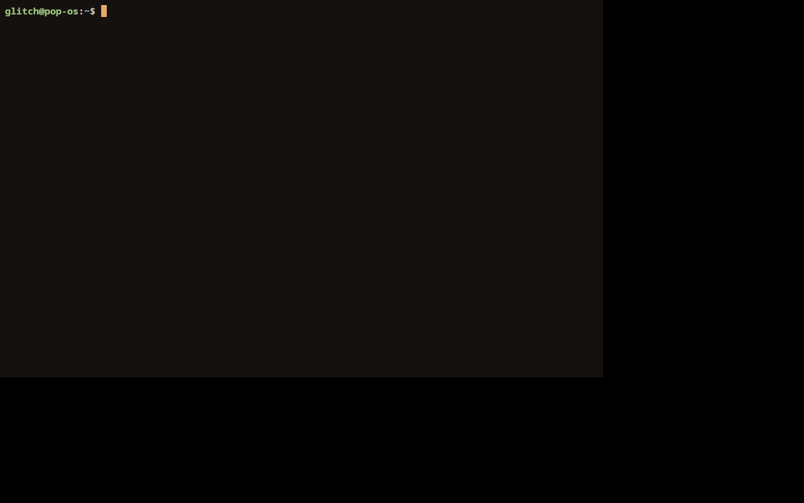

# shelvd

> *shelved* + *shell* — a once-advanced console, powered back up.

A GPU-accelerated, block-aware terminal emulator in **pure Rust**, in the spirit
of [Warp](https://github.com/warpdotdev/warp). First-class on **Linux, macOS, and
Windows** — no system webview, no C font stack.



## Status

**M0 — a working basic terminal.** Opens a GPU window, spawns your shell, parses
VT/ANSI output, renders the grid with truecolor + a block cursor, and forwards
keyboard input. Verified end-to-end (window → wgpu → PTY → parse → render).

See [the roadmap](#roadmap) for what's next.

## Why pure Rust

Every layer is Rust with no C dependencies in the hot path:

| Concern        | Crate                                   |
| -------------- | --------------------------------------- |
| Window + input | [`winit`](https://crates.io/crates/winit) 0.30 |
| GPU            | [`wgpu`](https://crates.io/crates/wgpu) 29 (Vulkan / Metal / DX12) |
| Text shaping   | [`glyphon`](https://crates.io/crates/glyphon) 0.11 → cosmic-text (rustybuzz + swash, no FreeType/HarfBuzz) |
| VT/ANSI + grid | [`alacritty_terminal`](https://crates.io/crates/alacritty_terminal) 0.26 |
| PTY            | [`portable-pty`](https://crates.io/crates/portable-pty) 0.9 (unix PTY / Windows ConPTY) |

## Architecture

A five-crate workspace, each layer depending only on what it needs:

```
shelvd-core    color · palette · GridSnapshot · theme · geometry   (no deps on the others)
shelvd-pty     spawn shell, reader thread → channel, write, resize
shelvd-term    alacritty parser + grid → resolves colors → GridSnapshot
shelvd-render  wgpu + glyphon: draw a GridSnapshot         (depends only on core)
shelvd-app     winit event loop wiring pty ↔ term ↔ render (binary `shelvd`)
```

The key seam: **`shelvd-term` fully resolves colors** (named/indexed/RGB,
inverse, bold-brighten) into a `GridSnapshot` of `Rgba` cells, so `shelvd-render`
stays decoupled from `alacritty_terminal` and just paints pixels.

## Build & run

```bash
cargo run --release        # opens a shelvd window running $SHELL
```

Dev build + lint:

```bash
cargo build --workspace
cargo clippy --workspace --all-targets
```

### Headless smoke test (CI / no display)

```bash
xvfb-run -a -s "-screen 0 1280x800x24" \
  env WAYLAND_DISPLAY= WGPU_BACKEND=vulkan \
      VK_ICD_FILENAMES=/usr/share/vulkan/icd.d/lvp_icd.json \
  timeout 6 cargo run
# surviving the timeout without a panic == window+GPU+shell+render all came up
```

## Roadmap

- **M1** — scrollback + mouse selection + copy/paste; TOML theme/config; cursor styles; bundled font.
- **M2** — Warp-signature **command blocks** (OSC-133 prompt marking), block navigation, per-block actions.
- **M3** — command palette, rich input editor, font/ligature configuration.

## License

MIT OR Apache-2.0.
